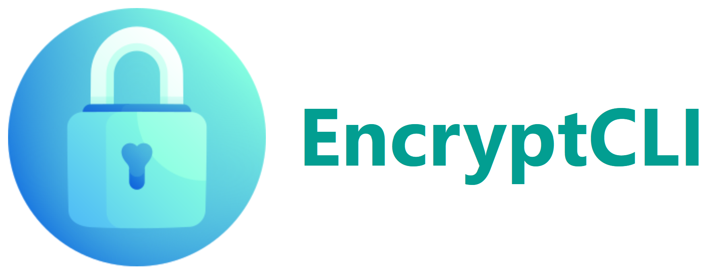
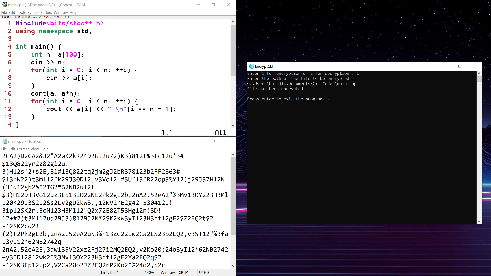

# EncryptCLI

<div align="center">
  
</div>

## About
EncryptCLI is a CLI Tool for encrypting documents and source codes.
It can encrypt files with ASCII Characters.

## Screenshot


## Downloads
- Windows 7 or above, 64-bit - [Download](https://github.com/K-Balaji/EncryptCLI/releases/download/3.0.0/EncryptCLI_Setup.exe)

## Test Locally
1. Install [Go](https://golang.org/).
2. Download this [ZIP Folder](https://github.com/K-Balaji/EncryptCLI/archive/refs/tags/3.0.0.zip) or this [tar.gz File](https://github.com/K-Balaji/EncryptCLI/archive/refs/tags/3.0.0.tar.gz).
3. Extract it to a directory of your choice.
2. Open the terminal, navigate to that directory and enter this - 
```
cd src
go run main.go
```

## Technologies Used
- [Go](https://golang.org/)
- [Go Standard Library](https://pkg.go.dev/std)

## Future Plans
- Fix bugs (if any)
- Add more advanced encryption algorithms

## Contributing
To contribute to this project, make a pull request.

## Credits
Icon by [Freepik](https://www.freepik.com/)

## License
[MIT License](./LICENSE)
