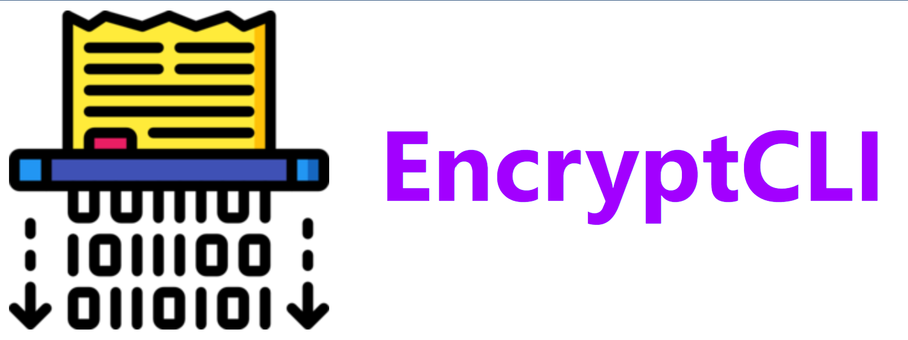

# EncryptCLI

## About
EncryptCLI is a CLI Tool for encrypting documents and source codes. It is registered under the MIT License.
It can encrypt files with ASCII characters.

## Downloads
- .class file : [Download](https://github.com/K-Balaji/EncryptCLI/releases/download/1.0-beta/encli.class)
- .exe file : [Download](https://github.com/K-Balaji/EncryptCLI/releases/download/1.0-beta/encli.exe)

## Technologies Used
- Java

## Future Plans
- Fix bugs (if any)
- Add more advanced encryption algorithms

## Contributing
To contribute to this project, make a pull request.

## License
[MIT License](./LICENSE)
